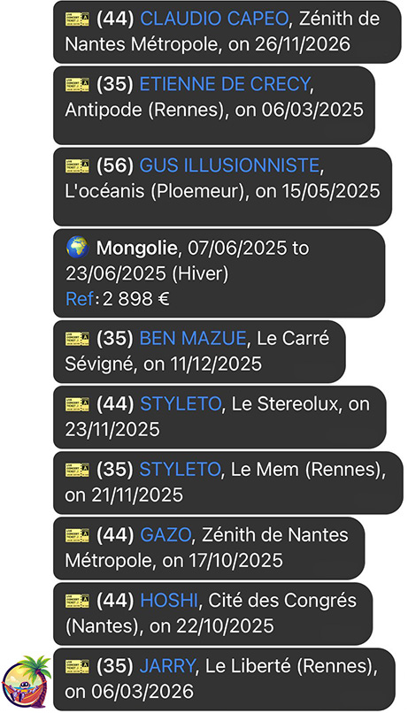

<p align="center"></p>
<h2 align="center">CCAS Scraper</h2>

<div align="center">


  
  [](https://github.com/itskovacs/ccas-scraper/issues)
  [](/LICENSE)

</div>

<p align="center">Scrape CCAS tickets and trips. Notify on Telegram.</p>
<br>

## 📦 About

Two scripts to notify about new tickets or trips: `tickets.py` and `trips.py`.
- `tickets.py` scrapes tickets (`portail-culture-et-loisirs.ccas.fr`) using Prestashop Webservice API
- `trips.py` scrapes assignment request trips (`gdscatalogueur.ccas.fr`) using the website

> [!IMPORTANT]  
CCAS updates its products every few weeks, while trips are only updated a few times a year, making daily scripts run unnecessary — please be considerate and avoid excessive requests

> [!NOTE]  
A Telegram bot is required. See [Telegram](#telegram) section for setup and ChatID retrieval

> [!WARNING]  
You're in charge — use responsibly!

<br>

## 🌱 Getting Started

Clone the repo, install the packages and copy the config file.

```bash
  # Clone repository
  git clone https://github.com/itskovacs/ccas-scraper.git
  cd ccas-scraper

  # Create and activate virtual env
  python -m venv venv
  source venv/bin/activate

  # Install dependencies
  pip install -r requirements.txt

  # Configure environment settings
  cp env.dist env.yaml
```
<br>

Edit the config file to fit your needs, it's pretty straightforward:
  - *Department features under `department_features` (see [department features](#dptfeatures) section),
  - **Telegram config under `telegram`

*: Mandatory for `tickets.py` only, **: Mandatory for both scripts

<br>

Run either script to be notified:
```python
  python tickets.py
  python trips.py
```

## 📸 Demo
<div align="center">
  
<br>
</div>


## Telegram  <a name = "telegram"></a>
### Create Telegram Bot
1. Go to your telegram account, then search for `@botfather` and start a conversation with him.
2. Type `/newbot` to create a new Telegram Bot. Name your bot and define its username.
3. BotFather will display your Bot API Token. Copy it somewhere safe (don't worry you can still view it later).

### Retrieve your ChatID
1. Create the channel you want your Bot to post into.
2. Add your newly created Telegram bot into this channel.
3. Send a message with your user to the channel
4. Open Telegram `getUpdates` endpoint in your browser (https://api.telegram.org/bot<your_bot_token>/getUpdates), it will display JSON data
5. In the JSON data, retrieve the value of the key `id` under `chat`.

You're all set to modify the `env.yaml` file with your *Bot Token* and channel *ChatID*.


## Department features  <a name = "dptfeatures"></a>
> [!NOTE]
**TL;DR** The department is specified by the `"id": "300"`

Many custom properties are located under the `associations` keys, of the Product's object.

Product's location is specified under `associations.product_features`, where every object maps an ID to a reference value. The department is specified by the `"id": "300"`, the region by `"id": "200"`, and so on for other properties.  

Here is an example, of a product having the department (`"id": "300"`) mapped to value `3040`, which represents department 75:
```json
"associations": {
  "combinations": [...],
  "product_option_values": [...],
  "product_features": [
    ...
    {"id":"300","id_feature_value":"3040"},
    ...
  ]
}
```

**List of department and their values**:
| Department | Value  |
|:--:|:----:|
| 01 | 3088 |
| 03 | 3007 |
| 05 | 3083 |
| 06 | 3084 |
| 08 | 3028 |
| 10 | 3029 |
| 11 | 3048 |
| 12 | 3061 |
| 13 | 3085 |
| 14 | 3011 |
| 16 | 3078 |
| 17 | 3079 |
| 18 | 3022 |
| 19 | 3053 |
| 21 | 3014 |
| 22 | 3018 |
| 23 | 3054 |
| 24 | 3002 |
| 25 | 3034 |
| 26 | 3090 |
| 28 | 3023 |
| 29 | 3019 |
| 30 | 3049 |
| 31 | 3062 |
| 33 | 3003 |
| 34 | 3050 |
| 35 | 3020 |
| 36 | 3024 |
| 37 | 3025 |
| 38 | 3091 |
| 39 | 3035 |
| 40 | 3004 |
| 41 | 3026 |
| 42 | 3092 |
| 44 | 3070 |
| 45 | 3027 |
| 46 | 3064 |
| 47 | 3005 |
| 49 | 3071 |
| 50 | 3012 |
| 51 | 3030 |
| 53 | 3072 |
| 54 | 3056 |
| 56 | 3021 |
| 57 | 3058 |
| 59 | 3068 |
| 60 | 3076 |
| 61 | 3013 |
| 62 | 3069 |
| 63 | 3010 |
| 64 | 3006 |
| 66 | 3052 |
| 67 | 3000 |
| 68 | 3001 |
| 69 | 3093 |
| 71 | 3016 |
| 72 | 3073 |
| 73 | 3094 |
| 74 | 3095 |
| 75 | 3040 |
| 76 | 3039 |
| 77 | 3041 |
| 78 | 3042 |
| 79 | 3080 |
| 80 | 3077 |
| 81 | 3066 |
| 82 | 3067 |
| 83 | 3086 |
| 84 | 3087 |
| 85 | 3074 |
| 86 | 3081 |
| 87 | 3055 |
| 88 | 3059 |
| 90 | 3037 |
| 91 | 3043 |
| 92 | 3044 |
| 93 | 3045 |
| 95 | 3047 |